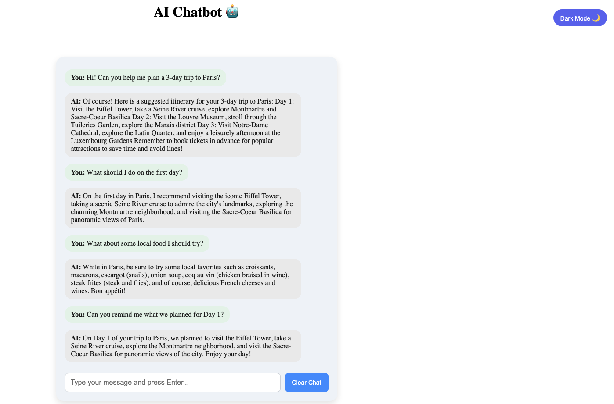
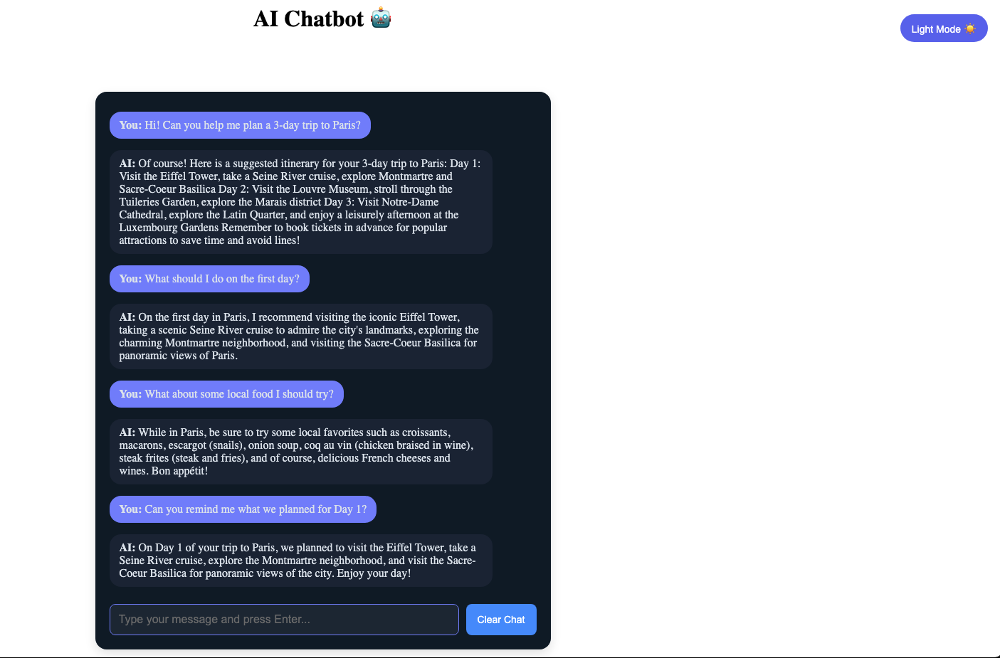

# 🤖 AI Chatbot - Next.js

A modern AI-powered chatbot built with **Next.js**, **Context API**, **Styled Components**, and **OpenAI API**.
Features include conversation memory, local chat persistence using `localStorage`, and a clear chat function.

## 🚀 Live Demo

🔗 [AI Chatbot - Live App](http://ai-chatbot-next-cyan.vercel.app/)

Light Mode


Dark Mode


## 🛠️ Tech Stack

- **Frontend**: Next.js, TypeScript, Styled Components
- **State Management**: Context API
- **UI Features**: Theme toggle (light/dark)
- **API**: OpenAI GPT-3.5 via OpenAI API
- **Testing**: Jest, React Testing Library
- **Deployment**: Vercel

## ✨ Features

- 🔁 Conversation memory across messages
- 💬 Clean chat interface with Styled Components
- 💾 Persistent message storage using `localStorage`
- 🔄 Clear chat button to reset the conversation
- 🌓 Light/Dark mode toggle with a modern theme switcher
- ⚡ Powered by OpenAI’s GPT-3.5 Turbo

## 📥 Installation Guide

### **1️⃣ Clone the Repository**

```sh
git clone https://github.com/sogolnaseri/ai-chatbot-next.git
cd ai-chatbot-next
```

### **2️⃣ Install Dependencies**

```sh
npm install
```

### **3️⃣ Set Up Environment Variables**

Create a `.env.local` file in the root directory of your project, and add your Together AI API key:

```sh
OPENAI_API_KEY=your_api_key
```

### **4️⃣ Run the development server**

```sh
npm run dev
```

Open http://localhost:3000 in your browser to see the chatbot in action.

### **5️⃣ Run Tests**

```sh
npm test
```

## ⚠️ Limitations

- The chatbot uses **GPT-3.5 Turbo**, which was trained on data up to **September 2021**.
- It may not provide accurate answers for recent events, current political figures, or anything post-2021.
